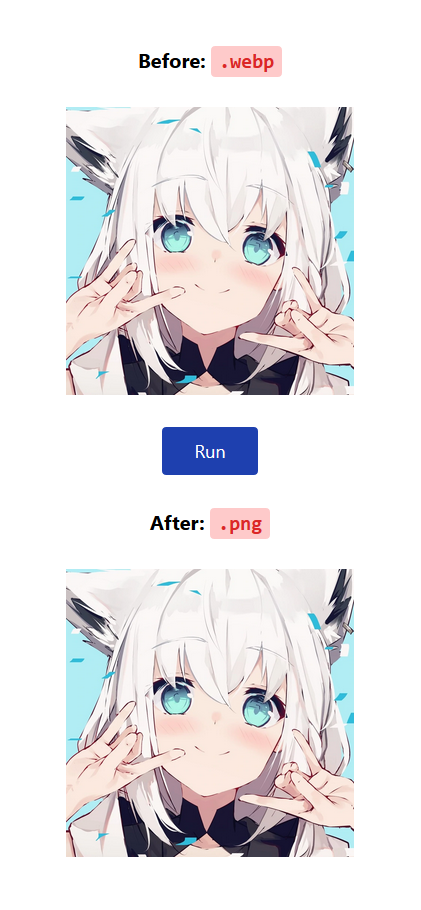

wasm-vips demo
===

A demo project using [`wasm-vips`](https://github.com/kleisauke/wasm-vips) to convert `.webp` image into `.png` in the browser.



Notes
---

- `wasm-vips` is compatible to support multiple image format, such as `jpeg`, `png`, `webp`, etc.

- Currently `wasm-vips` is not stable yet. The files published on npm is for node.js environment, not for web browser. So I just directly copy these files from the `wasm-vips` website:

  - `public/lib/vips.js` is from https://wasm-vips.kleisauke.nl/lib/vips.js
  - `public/lib/vips.wasm` is from https://wasm-vips.kleisauke.nl/lib/vips.wasm
  - `public/lib/vips.worker.js` is from https://wasm-vips.kleisauke.nl/lib/vips.worker.js

- `wasm-vips` use `SharedArrayBuffer` feature to improve performance. **This feature is only available to pages that are cross-origin isolated for future Desktop Chrome 91+, Android Chrome 88+, Firefox 79+**. More information at https://developer.chrome.com/blog/enabling-shared-array-buffer/.
  - Long story short, we need to **add these two header into respond http header on the server side** in order to make the page cross-origin isolated:
  ```
  Cross-Origin-Embedder-Policy: require-corp
  Cross-Origin-Opener-Policy: same-origin
  ```

  - If the page is not cross-origin isolated, the error `ReferenceError: SharedArrayBuffer is not defined` will occur, and `wasm-vips` won't work properly.

Todos
---

- [ ] deploy this project.
  - make sure the page is cross-origin isolated by adding custom http header mentioned above.
- [ ] support more format.
- [ ] allow user to select their own file as input image.
